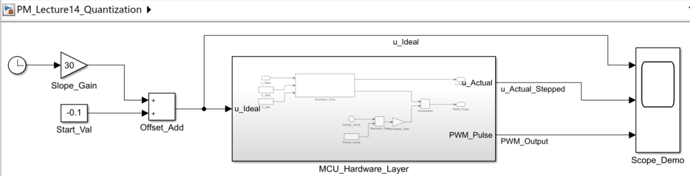
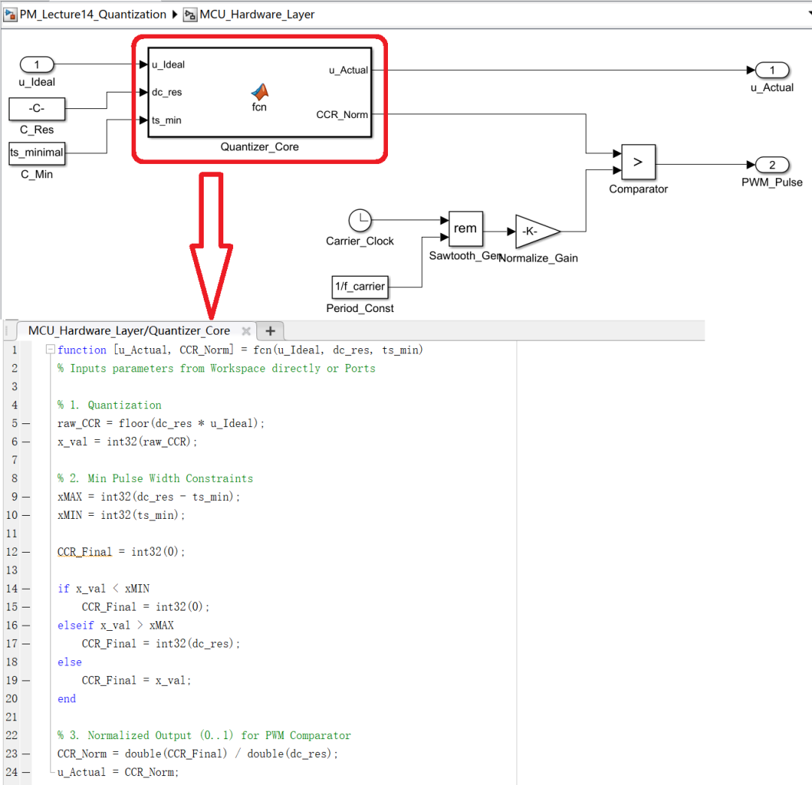
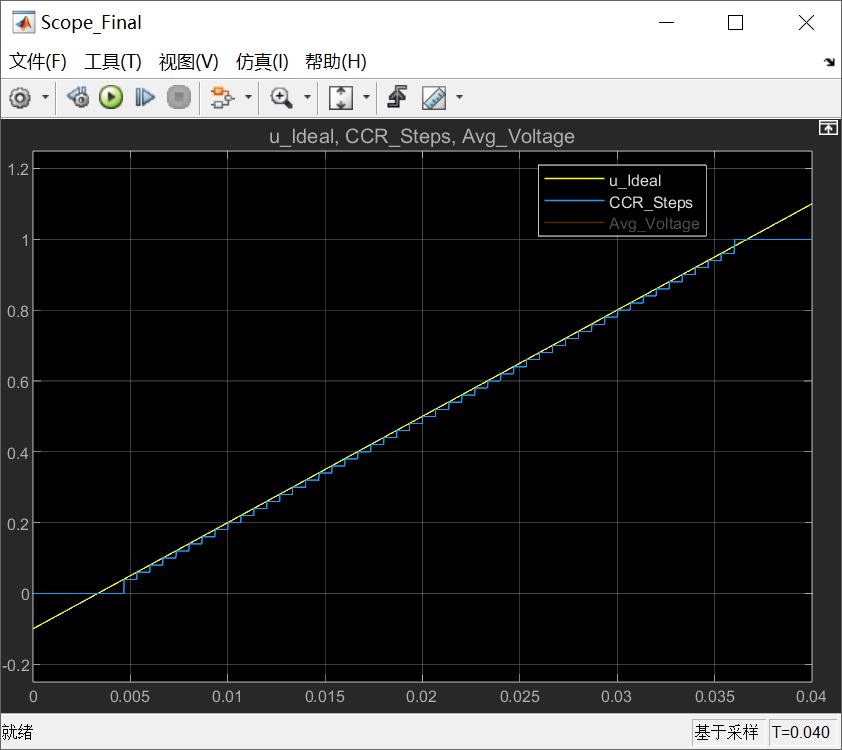
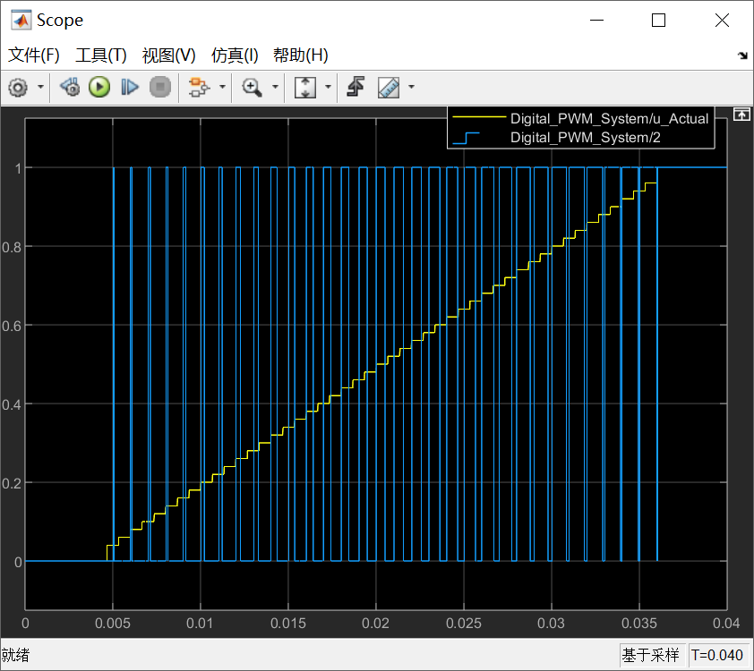
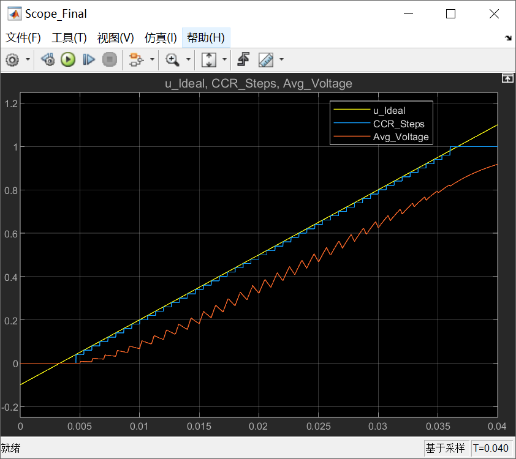
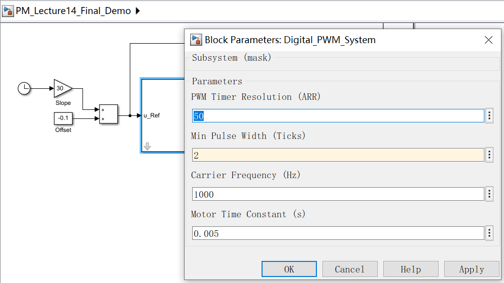
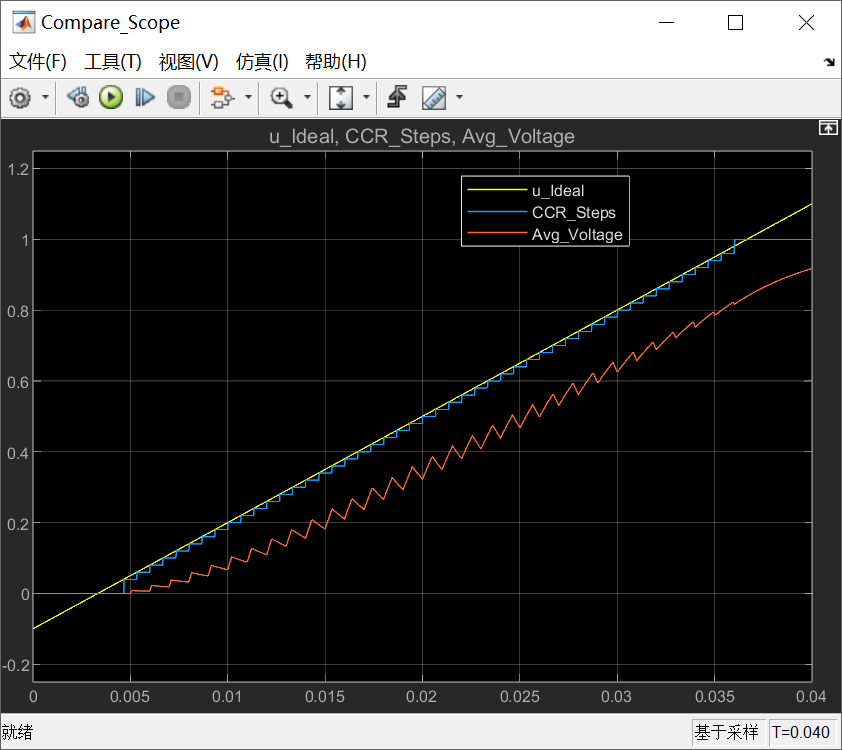
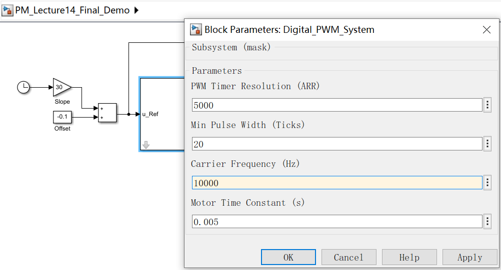
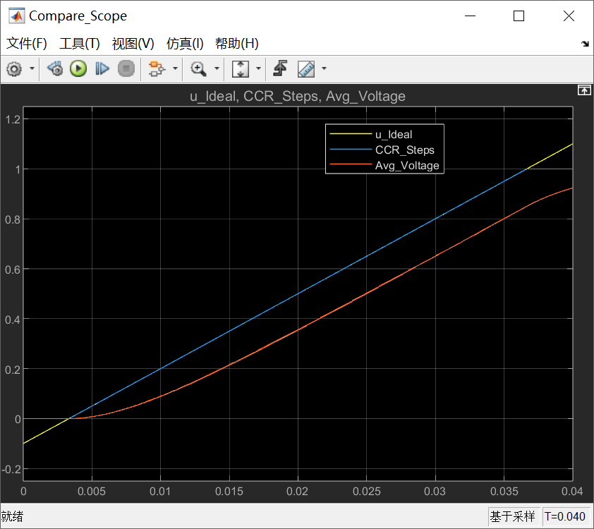

# 《零序注入SVPWM这件小事》｜14讲：占空比的颗粒——从浮点到CCR，理想被刻进刻度里

原创 傅存敬 电磁散人 2026-02-23 07:06 广东

> 原文地址: [https://mp.weixin.qq.com/s/FC3AFDJQhvaP9B5sUWsQWA](https://mp.weixin.qq.com/s/FC3AFDJQhvaP9B5sUWsQWA)

好，各位同仁，咱们继续解剖 pm\_voltage() 这条流水线。

到目前为止，我们做的所有计算——限幅、逆Clarke、零序注入——都还停留在**浮点数**的世界里。uA, uB, uC 这些变量，它们在理论上可以是任意精度的、连续的值，就像“连续的水流”。

但是，我们的硬件——PWM定时器，它不认识浮点数。它只认识**整数**，也就是**计数器**的值。我们要给它的，是 CCR (Capture/Compare Register) 寄存器里的一个整数值。

所以，在把我们的“完美占空比”送给硬件之前，必须经过一个看似简单，却处处是“坑”的步骤——**量化（Quantization）**。

* * *

**从浮点到整数的“最后一公里”**

咱们来看代码，这个步骤发生在 pm\_voltage() 函数的这里：

```
// ... 经过了零序注入，uA, uB, uC 是[0, 1]范围的浮点占空比
```

这段代码在做什么？

-   pm->dc\_resolution：这是PWM定时器的**计数分辨率**，也就是 ARR 寄存器的值。比如，如果PWM频率20kHz，MCU主频200MHz，中心对齐模式，那么 ARR 就是 **200MHz / (20kHz \* 2) = 5000**（在文末的共享代码里，这个变量的真实值是2940， 使用了168MHz的STM32F405这颗芯片，在文件 PHOBIA\_rev5.h 中定义，为了描述方便，本文假定 ARR 的值是5000）。
    
-   pm->dc\_resolution \* uA：把 \[0, 1\] 范围的浮点占空比，映射到 \[0, 5000\] 这个整数范围。
    
-   (int)：强制类型转换，把浮点数结果的小数部分**截断**，变成一个整数。
    

这个过程，就像我们把一桶“连续的水”，装进了一个个有固定刻度的“量杯”里。你原来可能是3.75升，装进去之后，就只能是3升或者4升了。这就是“**刻度的雨**”，每一滴，都有它固定的体积和边界。

这个“边界”，就是**量化误差**。它会带来两个非常现实的工程问题：

1.  **低占空比时的“非线性”和“死区”：**
    

假设咱们的分辨率是5000，若想输出一个0.01%的占空比，对应的CCR值应该是 5000 \* 0.0001 = 0.5。经过 (int) 截断，变成了 0 ！咱们想要的微小电压，被“吃”掉了。只有当指令超过 1/5000 时，CCR值才能从0跳到1。这就导致在接近零输出的区域，电压响应不是平滑的，而是一个“台阶”。这在电机低速、轻载时，会引起转矩脉动和抖动。

2.  **极限占空比的“卡顿”：**
    

你想输出99.99%的占空比，对应的CCR是4999.5，截断后是4999。你想输出99.995%，CCR是4999.75，截断后还是4999。只有当你指令达到100%，CCR才能跳到5000。这同样会在接近满占空比时，引入非线性。

* * *

**守住硬件的“底线”——最小脉宽约束**

量化误差还只是“软件”层面的问题。硬件层面，还有一个更要命的约束——**最小脉宽（Minimum Pulse Width）。**

我们的功率器件（MOSFET/IGBT）和栅极驱动器，它们的开关是需要时间的。如果你给一个非常非常窄的脉冲，比如只有几十纳秒，驱动器可能根本来不及响应，或者功率管刚打开一点点就关了，处于一种“半开不开”的危险状态，发热巨大。

所以，任何一个可靠的驱动系统，都必须有一个**最小脉宽的保证**。任何比这个值还窄的脉冲，都应该被**过滤掉**（直接变成0%或100%占空比）。

代码 pm.c 的作者，就用一段非常精巧的代码，来守住了这条“硬件底线”。

我们就以 pm\_voltage() 函数中的 PM\_IFB\_AB\_INLINE 分支为例。

```
// ... 经过了各种修正，xA, xB, xC 是整数CCR值
```

这段代码在做什么？

-   pm->ts\_minimal：这就是预先计算好的“最小脉宽”对应的**CCR计数值**。比如，最小脉宽是200ns，分辨率5000对应25us，那么 ts\_minimal 就是 5000 \* (200ns / 25us) = 40。
    
-   xMAX 和 xMIN 定义了一个“安全区”。
    
-   xA = (xA < xMIN) ? 0 : (xA > xMAX) ? pm->dc\_resolution : xA：如果算出来的CCR值 xA，小于最小脉宽计数值 xMIN，那就别输出了，**直接把它变成0**。如果 xA 太接近满占空比，使得“关断”的那个窄脉冲小于 ts\_minimal，那就也别折腾了，**直接让它100%输出**。
    

这就是在做“**脉冲过滤**”。它牺牲了在极低和极高占空比区域的一点点线性度，换来了整个功率级的**安全和可预测性**。

* * *

**Simulink 演示**

今天，咱们要在Simulink里，亲眼看看这些“颗粒”和“底线”是如何影响波形的

1.  **信号源：**
    

-   用一个**非常缓慢的、幅值非常小的**斜坡信号，作为电压指令，让它慢慢地穿过“零点死区”。
    
-   再用一个**幅值接近1**的斜坡信号，让它慢慢地穿过“满占空比饱和区”。
    



2.  **搭建一个带量化和最小脉宽的模型：**
    

-   **量化模块 (Quantizer)**：把 \[0, 1\] 的浮点占空比，乘以分辨率，然后取整，再除以分辨率。
    
-   **最小脉宽限制模块**：用 if/else 逻辑，严格复现代码里的 xA = (xA < xMIN) ? 0 : (xA > xMAX) ? pm->dc\_resolution : xA 逻辑。
    



3.  **观测结果：**
    

我们首先观察一下理想电压指令曲线和寄存器实际输出的电压曲线。



各位同仁，请看上图，谁是“连续的水”，谁是“刻度的雨”已经非常清楚了。

黄色线 (u\_Ideal)，一条平直上升的线，这是“连续的水”，蓝色线 (CCR\_Steps)，这是寄存器 CCR 里存储的电压值，呈阶梯状上升，这是“刻度的雨”。像“楼梯”一样的粗大台阶，是特意夸大的**量化误差**。每一个台阶，就代表定时器计数器的一个 Tick。

请注意起始位置的“大台阶”（死区）和结束位置的“平顶”（饱和）。

看图片左下角靠近0刻度的位置，即使 u\_Ideal 已经大于 0 了（比如 0.001），CCR\_Steps 依然保持为 0。只有当 u\_Ideal 超过某个阈值（对应 ts\_minimal），CCR\_Steps 才会突然跳变成非零值。这个“跳变”就是硬件最小脉宽限制带来的**非线性效应**。同样，看上图的右上角，在 **1.0** 附近，可以看到 CCR\_Steps 提前到达 1.0 并保持平顶，这也是 ts\_minimal 导致的“**上管导通保护**”。

咱们再来看一下对应的PWM信号与 CCR\_Steps 的关系：



我们着重看蓝色的PWM波形，死区结束时间在大约0.004秒左右，而且，PWM 脉冲不是从无限窄慢慢变宽的，而是**突然蹦出来一个有一定宽度的脉冲**。这个“突然出现的脉冲”，其宽度就对应着 ts\_minimal（本例中设为2个Tick，即 4% 占空比）。

感兴趣（或爱较真儿）的同仁，可以打开文末的模型用放大镜观测一下PWM的占空比，你会发现，只要 CCR 值不变，PWM 输出的蓝色脉冲宽度就纹丝不动（虽然时间在流逝，脉冲在重复），尽管此时作为真实指令的电压 u\_Ideal 是在线性增加的。

在以上条件下，咱们再加入一个RL串联电路（其实在模型里被等效成了一个一阶低通滤波器，滤波器的时间常数 τ = L/R），用于模拟电机的某一相绕组，看下这一相的电流波形：



从上图中清晰可见，橙色线（滤波后的平均电压）明显滞后于黄色线（理想指令）。这是因为电感（低通滤波器）具有惯性，电流不能突变，必须慢慢爬升。同时橙色线也不是平滑的曲线，而是带有锯齿状的纹波。这是因为 PWM 频率（1kHz）相对于滤波器时间常数来说还不够快，导致“开关动作”的痕迹被保留了下来。尽管有波纹，但它的**平均趋势**紧紧跟随着通道 2 的阶梯。**死区**效应也清晰可见：在开始阶段（t < 0.004s），它是平的（0V），直到 PWM 脉冲突然出现，它才开始缓慢上升。

这个波形证明了，虽然“量化”把连续的水变成了刻度的雨，虽然“最小脉宽”切掉了一部分信号，但经过电机的电感滤波后，我们依然得到了一股**虽然有波动、但总体受控**的电流（能量流）。

最后，这个模型被我封装成了一个Mask，点击模块后，可以直接修改 分辨率、最小脉宽、载波频率 等参数，点 Apply 就能看到波形变化，无需去改内部代码。

咱们模拟一个相对低端的MCU（Res=50, Min=2）：



波形像粗糙的楼梯：



咱们再模拟一个相对高端的DSP（Res=5000, Min=20，Carrier Fre = 10K）：



波形极其丝滑：



以上这个实验，就把理论世界和现实世界的“鸿沟”，血淋淋地展示了出来。它告诉我们，一个鲁棒的FOC算法，不仅要懂SVPWM的数学，更要懂得尊重硬件的“脾气”。

到此为止，我们已经把 pm\_voltage() 里的调制和约束的核心部分都过了一遍。下一讲，我们就要进入一个更“纠结”的话题——**采样窗口**。看看 pm\_clearance() 这个函数，是如何像一个“交通警察”一样，为ADC采样指挥交通、清理道路的。

好，今天就到这里。大家可以思考一下，PWM分辨率越高，量化误差就越小。那我们是不是应该无脑地把分辨率提得越高越好？它会带来什么新的代价吗？（提示：想想MCU主频和PWM频率的关系）

  

参考代码：https://github.com/rombrew/phobia/tree/master/src/phobia

参考文献：

\[1\] Zhou K , Wang D .Relationship Between Space-Vector Modulation and Three-Phase Carrier-Based PWM: A Comprehensive Analysis.\[J\].IEEE Transactions on Industrial Electronics, 2002.

文献链接：

https://pan.baidu.com/s/1R6veKtYAG86LhfOXaLKJxw?pwd=rdf7 提取码: rdf7

模型链接：https://pan.baidu.com/s/1qclWzEtgLE3WXDk73UcJZw?pwd=sbda 提取码: sbda