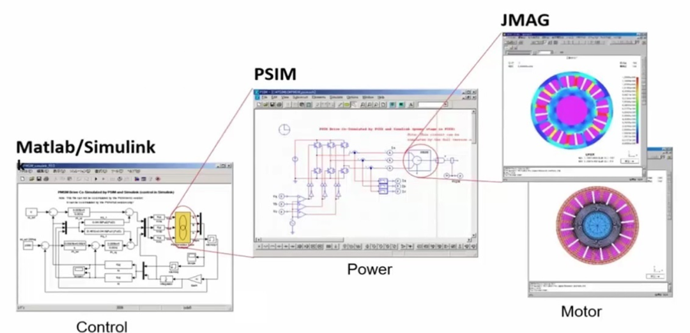

# 从电磁到代码：无刷直流电机这条河流的三种时间

原创 傅存敬 电磁散人 2025-09-28 21:23 广东

> 原文地址: [https://mp.weixin.qq.com/s/L4-kRYOgIzoA-9xsZ7Mcug](https://mp.weixin.qq.com/s/L4-kRYOgIzoA-9xsZ7Mcug)

人类的才情，总像大地上奔流的江河。它们源出万壑，各自挟带着沿途的风物与声息，向着同一个海洋日夜奔赴。然而，在真正汇入那片蔚蓝之前，每一条河流，都固守着自身独特的时间。

在我们这个以微秒计成败的世界——无刷直流电机行业，这条名为“创造”的河流，便被赋予了至少三种不同的时间。

**第一种，是属于“电磁”与“结构”的时间。**它坚硬、沉重，如同磐石的生长。一次开模，便是一次地质纪元般的决策，动辄斥以巨资，凝固下昂贵的期许。它的节拍以“**月**”为单位，每一次落锤，都回响着不容更改的庄严。在这样的时间里，人们追求的是一步到位的完美，是交付给岁月的一尊无悔的雕塑。这是**磐石的时间**。

**第二种，是属于“电子”与“半导体”的时间。**它精密、审慎，如同匠人的打磨。一款控制器的诞生，从原理图到PCB布线，再到散热外壳，从制板到贴片、插件，无一不是在方寸之间，营建一座微缩的城池。它的节拍以“**周**”为单位，每一次修改，都像是对传世工艺的精修与校准。在这样的时间里，人们在固定的疆域内，追求着极致的稳定与可靠。这是**匠人的时间**。

**第三种，是属于“算法”与“代码”的时间。**它轻盈、迅捷，如同旷野上的风。一段逻辑的重构，一个参数的更新，便可瞬息之间，赋予躯体以全新的灵魂。它的节拍以“**天**”甚至“小时”为单位，自由灵动，来去无踪。在这样的时间里，人们习惯了快速的迭代与试错，信仰的是永无止境的优化。这是**风的时间**。

当这三种时间在同一个项目、同一个屋檐下交汇，便产生了我们这个行业最深刻的困惑与寂寥。磐石的沉稳，无法理解风的善变；匠人的严谨，困惑于磐石的迟缓。于是，我们听到了那声深沉的叹息——“对牛弹琴”，“鸡同鸭讲”。我们本都是顶尖的高手，却仿佛来自不同的纪元，说着各自优雅而对方不解的语言。

总有不甘者，要在这时间的错层中，求一个答案。他孤独地登临高楼，望尽那片江河交汇处的混沌。他想用一种统一的语言——仿真的语言，为这三种时间校准节拍。他用数字的泥沙，搭建起一座座模型，在虚拟的世界里，预演着磐石的每一次心跳，记录着风的每一次呼吸。他“为伊消得人憔憔”，试图在开模之前，看清所有的未来。

这是一条何其正确，又何其艰难的路。然而，当他沉浸其中，真正的顿悟，却在另一处发生。

他蓦然发现，**这三种时间，并非矛盾，而是一种绝妙的互补。**我们不必强求风去拥有磐石的节奏，而是应该用风的灵动，去拥抱磐石的稳重。

于是，我们看见了新的图景：

在磐石还未凝固之前，让无数阵迅捷的风，带着代码的智慧，去反复吹拂、探测那即将成型的设计。风会告诉磐石，哪一种形态，在未来最能抵御现实的湍流。这是用最低的成本，为最昂贵的决策，献上最确切的祝福。

当磐石已经铸就，亘古不变，我们也不必嗟叹。因为风依然在。风可以在磐石的棱角间，吹奏出新的旋律，用算法的柔情，去抚平物理的粗粝。产品的灵魂，因此得以在固化的躯体上，持续生长。

那一刻，我们才真正理解。我们的使命，不是要将所有河流都统一成相同的流速，而是要成为那个高明的“水利工程师”。我们勘测地势，营造落差，**让“慢”成为“快”的基石，让“快”成为“慢”的眼睛。**

最终，所有的争论、所有的隔阂，都将消解在那一个共同的入海口——客户的心海。我们的所有努力，不再是为了捍卫某一种时间的尊严，而是为了让远方那盏无人机的续航灯，能再多亮一分钟；是为了让医生手中的牙钻，那份震颤能再轻微一分。

**当视角从技术的高塔，最终转向了价值的原野，所有的时间，都找到了它的意义。**

所以，朋友，当你正为那漫长的开模周期而焦虑，当你正为那一行代码的调试而熬到深夜，请不必感到孤单或沮丧。你只是在守护着属于你的那一条时间之河。

而更高的智慧，在于抬头看。看看身旁那些流速不同的同伴，看看我们共同奔赴的海洋。

总有一天，你会豁然开朗。我们毕生的求索，不是要成为河流本身，而是要成为那个懂得如何让百川汇流、奔腾入海的人。在那江河交汇之处，所有时间的差异，都将凝结成一道共同的光，照亮我们为这个世界创造的价值。

而那道光，便是我们所有奋斗者，最终的慰藉与勋章。

  

  

**附记：**

无刷直流电机（永磁同步电机）及其控制器，是一个“机电软一体化”的产品。需要不同技术方向的专家共同努力开发，但每个技术方向都是一口“知识深井”，且井与井之间往往是隔断的，越是在井里挖得深的专家，在彼此需要沟通协作时，越会感觉到“鸡同鸭讲”，因为大家都是从自己的井口向外喊话。

我近几年一只尝试着打通JMAG（电磁、热、振动）、PSIM（电力电子、热）、Simulink（逻辑、算法）的联合仿真平台，为不同领域的工程师们建立“共同语言”的基石。今日才突然知道，这种行为在行业里早就有迹可循，这种思想形态被称为“**数字孪生（Digital Twin）**”，此时我的内心悲喜交集。

